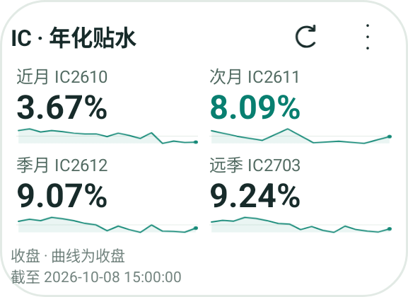
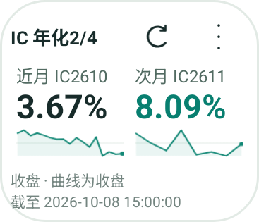
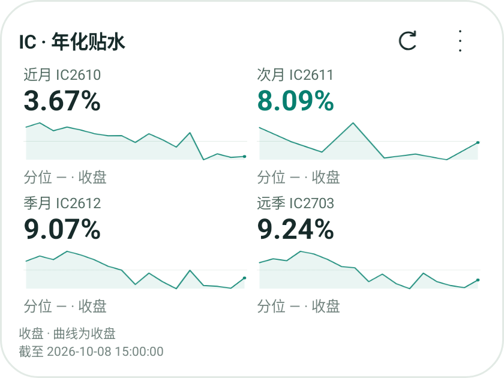

# Four-maturity widget verification — 2026-10-09

Bark Android 0.4.2 / version code 10.

- Local `:core:test :app:testDebugUnitTest :app:assembleDebug`: 136 core and 106 app tests passed.
- API 35 ARM64 emulator `bark_ui_api35`: actual Android RemoteViews inflated and drawn at 220×160, 140×120 and 320×240 dp. Screenshots below show the production rendering code, not a web mockup.
- Public IC mobile-summary fixture fetched on 2026-10-09 returned four **2026-10-08 15:00 closes**, with 17/8/17/17 history points. Screenshots retain that source time. These values are rendering evidence, not today's live market analysis.
- 220×160: all four maturities and four curves fit. 140×120: two maturities and two curves, with visible 2/4 title. 320×240: all four curves plus percentile/status.
- A preview activity exists only in `src/debug`; the processed release manifest was checked to exclude it.
- No physical handset was attached. OEM launcher behavior, background refresh timing, installation on the user's phone and notification delivery remain unverified by this UI check.

## Reproduce the rendering

Build and install the debug APK on an emulator. Save the public IC
`/api/mobile-summary?family=IC` response to the debug app's private
`files/widget-preview.json` (for example via `adb push` and `adb shell run-as`).
Launch `day.bark.android/.projects.widget.BasisWidgetPreviewActivity` with integer
`width` and `height` extras. It applies the production RemoteViews, then writes
`files/widget-preview-WIDTHxHEIGHT.png`, readable through `adb exec-out run-as`.
The fixture does not replace the app's basis cache or register a Bark device.
