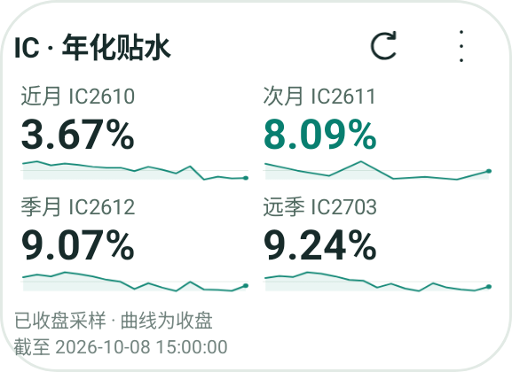
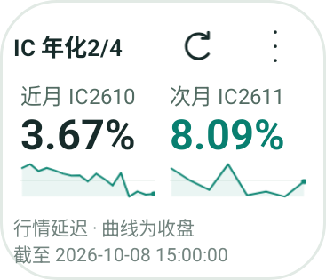
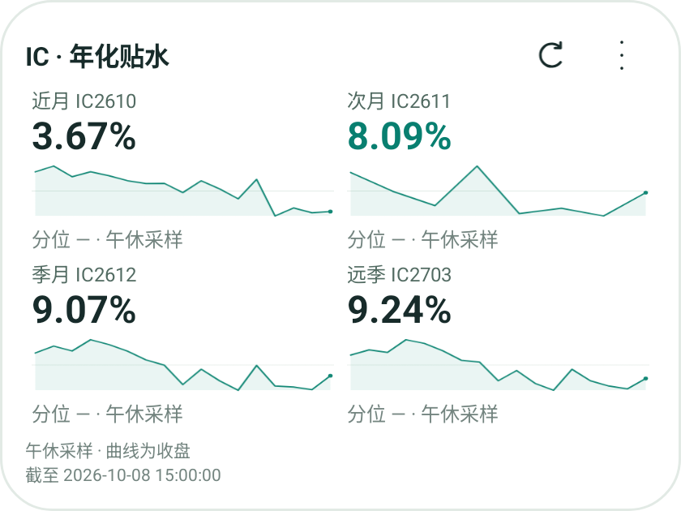

# Sampled quote widget verification — 2026-10-09

Bark Android 0.4.3 / version code 11.

- Local `:core:test :app:testDebugUnitTest :app:assembleDebug`: 139 core and 107 app tests passed.
- Regression coverage includes one stale maturity alongside a fresh one, quote-time regression with new history, restart and HTTP 304, same-source-time session transitions, and real-contract rollover.
- API 35 ARM64 emulator `bark_ui_api35` inflated and drew the production RemoteViews at 220×160, 140×120 and 320×240 dp. Labels, four/two values, curves and absolute timestamps fit.
- These screenshots are **synthetic state fixtures for rendering only**. The public IC API supplied 2026-10-08 close values and curves; only `kind` and `freshness.state` were changed to exercise `sampled` with `closed`, `stale` and `paused`. They are not evidence of current quotes or a current market session.
- `已收盘采样` describes the server's session state; it does not claim the quote is the official closing value. The original source timestamp remains visible.
- No physical handset was attached. WorkManager still uses a 15-minute periodic request that Android may defer; the foreground card requests data every minute. These checks do not verify installation or OEM timing on the user's phone.

